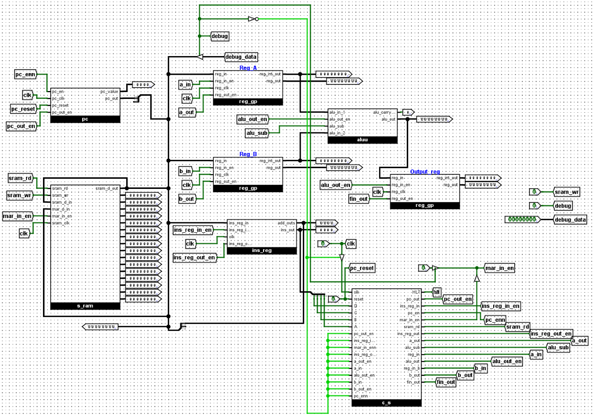
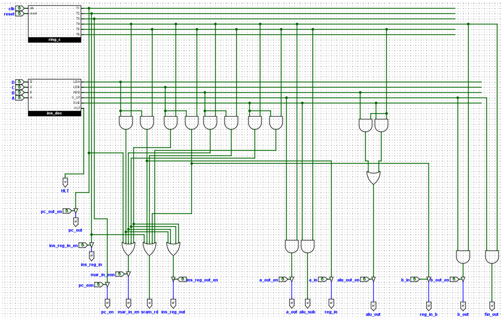

# Control-Sequencer-for-SAP-1-Architecture
This project implements a control sequencer for the SAP-1 (Simple As Possible) architecture. The sequencer coordinates the execution of a 6 T-state instruction cycle (fetch and execute phases) for instructions including LDA, LDB, ADD, SUB, OUT, and HLT. 

### Circuit Diagram

Figure 1: SAP-1 Architecture Diagram

Figure 2: Control Sequencer Diagram

# Features
**Instruction Set:** Supports 8-bit instructions (4-bit opcode, 4-bit operand) for operations: LDA (Load A), LDB (Load B), ADD, SUB, OUT, and HLT.
**Control Sequencer:** Generates control signals (mar_in_en, pc_out_en, sram_rd, ins_reg_in_en, etc.) to manage data flow between the program counter, memory, ALU, and registers.
**Architecture:** Includes Program Counter (PC), Memory (RAM), Instruction Register (IR), Registers A and B, ALU (Adder/Subtractor), Output Register, and Control Unit.
**Documentation:** Detailed in Control_Sequencer_Instruction-set.pdf, covering architecture, instruction formats, and T-state operations.

# Technologies Used
**Simulation Tools**: Logisim Evolution

# License
This project is licensed under the MIT License. See the LICENSE file for details.

